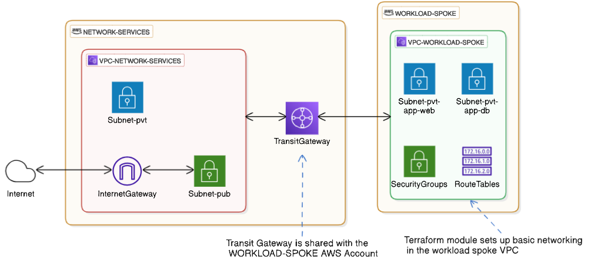

# Terraform module : `workload-spoke-vpc`
This Terraform module sets up basic networking in a workload spoke VPC on AWS, where all ingress/egress traffic enters/exits the VPC via a transit gateway in another AWS account.

